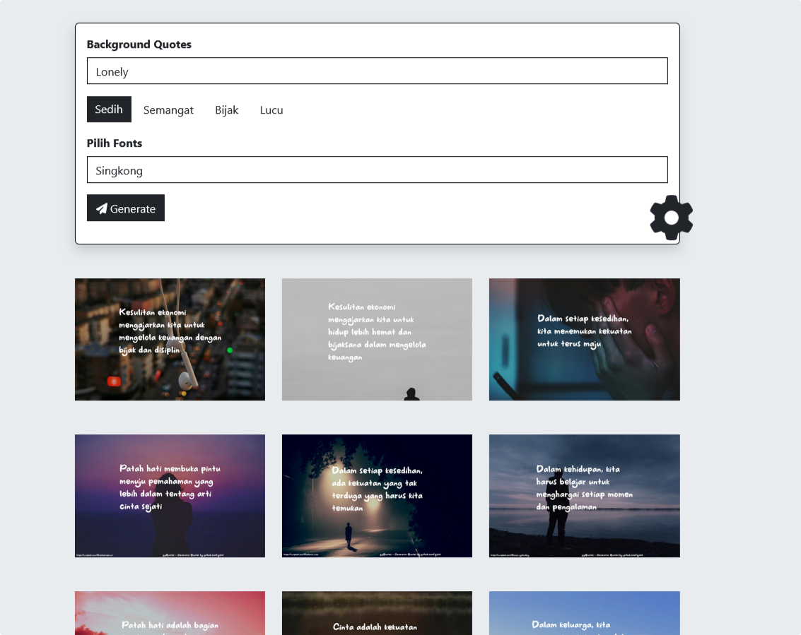

# ggQuotes - Generator Quotes Maker
<p align="center">
  
</p>
## Apa Itu ggQUOTES ?

ggQuotes merupakan tools untuk membuat kutipan motivasi, kata kata lucu, sedih, semangat pada gambar secara instant. ggQuotes dibuat dengan CodeIgniter framework web full-stack PHP yang ringan, cepat, fleksibel dan aman.
## Demo
<p align="center">
  <br>
  Halaman Home
</p>

<p align="center">
  <br>
  Selesai Proses
</p>

<p align="center">
  <br>
  Hasil
</p>


## Installation & updates

`composer create-project codeigniter4/appstarter` then `composer update` whenever
there is a new release of the framework.

When updating, check the release notes to see if there are any changes you might need to apply
to your `app` folder. The affected files can be copied or merged from
`vendor/codeigniter4/framework/app`.

## Setup

Salin `env` ke `.env` dan sesuaikan untuk aplikasi Anda, khususnya baseURL
dan pengaturan basis data apa pun.


## Server Requirements

Diperlukan PHP versi 7.4 atau lebih tinggi, dengan ekstensi berikut diinstal:

- [intl](http://php.net/manual/en/intl.requirements.php)
- [mbstring](http://php.net/manual/en/mbstring.installation.php)

> [!PERINGATAN]
> Tanggal akhir masa pakai PHP 7.4 adalah 28 November 2022.
> Tanggal akhir masa pakai PHP 8.0 adalah 26 November 2023.
> Jika Anda masih menggunakan PHP 7.4 atau 8.0, sebaiknya segera upgrade.
> Tanggal akhir masa pakai PHP 8.1 adalah 25 November 2024.


Selain itu, pastikan ekstensi berikut diaktifkan di PHP Anda:

- json (diaktifkan secara default - jangan matikan)
- [mysqlnd](http://php.net/manual/en/mysqlnd.install.php) jika Anda berencana menggunakan MySQL
- [libcurl](http://php.net/manual/en/curl.requirements.php) jika Anda berencana menggunakan perpustakaan HTTP\CURLRequest

## Noted
Dikarnakan ini tidak menggunakan mysql sebagai databases, tapi menggunakan file json, file ada pada folder
`public/assets/data/data.json` dan jika ingin menambahkan font silahkan paste di `public/assets/fonts/` dengan extensi ttf,otf,woff.

---
## Setting
Ubah Secret Key pada controller `Apiajax`

```php
$secretKey = "SECRET_KEY_DISINI";
```
